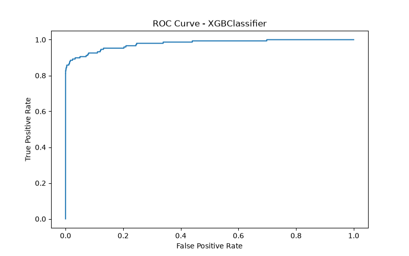
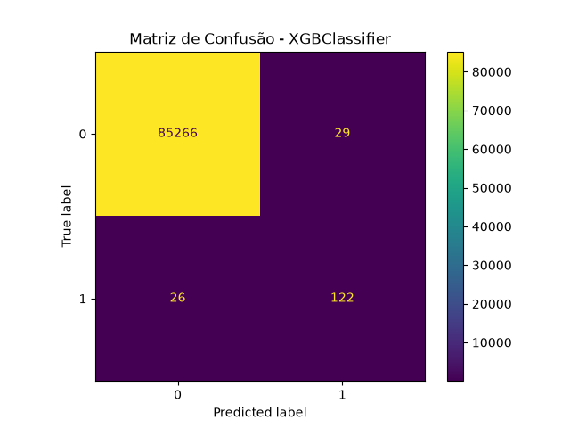
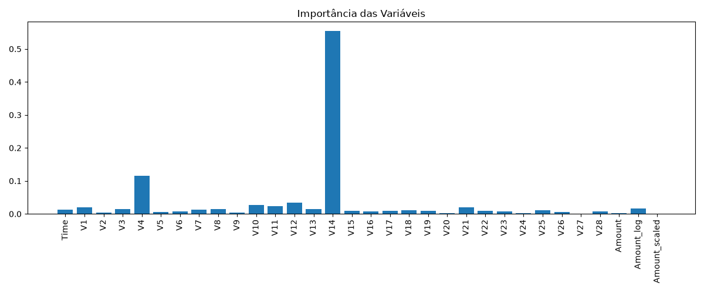

# 🛡️ Detecção de Fraudes em Cartão de Crédito

Projeto de Machine Learning para identificação de transações fraudulentas em cartões de crédito utilizando técnicas de balanceamento de dados, treinamento de múltiplos modelos e comparação de desempenho.

---

# 📋 Sobre o Projeto

Fraudes em cartões de crédito representam um grande desafio para instituições financeiras devido à enorme quantidade de transações realizadas diariamente.

Este projeto utiliza algoritmos de Machine Learning para identificar padrões suspeitos e classificar automaticamente transações como legítimas ou fraudulentas.

O objetivo principal é comparar diferentes modelos e selecionar a melhor solução para detecção de fraudes.

---

# 🚀 Tecnologias Utilizadas

* Python 3.11
* Pandas
* NumPy
* Matplotlib
* Scikit-Learn
* Imbalanced-Learn (SMOTE)
* XGBoost
* Joblib

---

# 📁 Estrutura do Projeto

```text
deteccao-fraudes-cartao/
│
├── data/
│   ├── raw/
│   └── processed/
│
├── docs/
│   ├── imagens/
│   └── apresentacao/
│
├── models/
│   ├── logistic.pkl
│   ├── random_forest.pkl
│   ├── xgboost.pkl
│   └── best_model.pkl
│
├── notebooks/
│
├── results/
│   ├── metricas.csv
│   ├── XGBClassifier_roc.png
│   ├── XGBClassifier_confusion_matrix.png
│   └── feature_importance.png
│
├── src/
│   ├── config.py
│   ├── data_loader.py
│   ├── preprocessing.py
│   ├── train.py
│   ├── evaluate.py
│   └── main.py
│
├── README.md
├── requirements.txt
└── .gitignore
```

---

# 📊 Dataset

O projeto utiliza o dataset público de transações financeiras disponibilizado pelo TensorFlow.

O download é realizado automaticamente na primeira execução.

Características:

* 284.807 transações
* 31 colunas
* Forte desbalanceamento entre classes
* Variável alvo: `Class`

  * 0 = Transação legítima
  * 1 = Fraude

---

# ⚙️ Pré-Processamento

Etapas realizadas:

* Carregamento automático do dataset
* Transformação logarítmica da variável Amount
* Padronização dos valores monetários
* Separação entre treino e teste
* Balanceamento utilizando SMOTE

---

# 🤖 Modelos Treinados

## Logistic Regression

Modelo linear utilizado como baseline.

### Resultado

* Recall: 0.804
* Precision: 0.181
* F1 Score: 0.296
* ROC AUC: 0.924

---

## Random Forest

Modelo baseado em árvores de decisão.

### Resultado

* Recall: 0.838
* Precision: 0.617
* F1 Score: 0.711
* ROC AUC: 0.975

---

## XGBoost

Modelo de Gradient Boosting.

### Resultado

* Recall: 0.824
* Precision: 0.808
* F1 Score: 0.816
* ROC AUC: 0.978

---

# 🏆 Melhor Modelo

Após a comparação automática dos modelos, o melhor desempenho foi obtido pelo:

## XGBoost

### Métricas

| Métrica   | Valor |
| --------- | ----- |
| Recall    | 0.824 |
| Precision | 0.808 |
| F1 Score  | 0.816 |
| ROC AUC   | 0.978 |

O modelo é salvo automaticamente em:

```text
models/best_model.pkl
```

---

# 📈 Visualizações

## Curva ROC



---

## Matriz de Confusão



---

## Importância das Variáveis



---

# ▶️ Como Executar

## Clonar repositório

```bash
git clone https://github.com/eltonjsilva05-spec/deteccao-fraudes-cartao.git
```

## Entrar na pasta

```bash
cd deteccao-fraudes-cartao
```

## Criar ambiente virtual

```bash
python -m venv .venv
```

## Ativar ambiente

Windows:

```bash
.venv\Scripts\Activate.ps1
```

## Instalar dependências

```bash
pip install -r requirements.txt
```

## Executar projeto

```bash
cd src
python main.py
```

---

# 📌 Resultados

O sistema:

* Baixa automaticamente o dataset
* Realiza o pré-processamento
* Balanceia os dados com SMOTE
* Treina três modelos
* Compara os resultados
* Seleciona automaticamente o melhor modelo
* Salva métricas e gráficos
* Exporta o modelo final

---

# 👨‍💻 Autor

**Elton Silva**

Projeto desenvolvido para estudos em Ciência de Dados, Machine Learning e construção de portfólio profissional.
