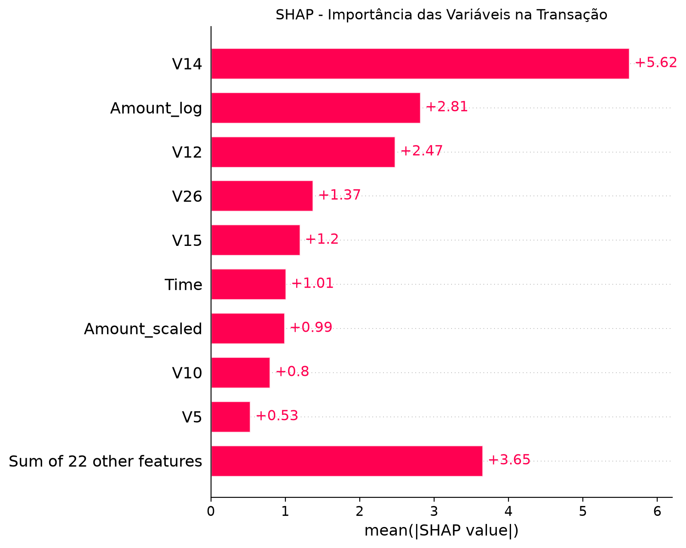
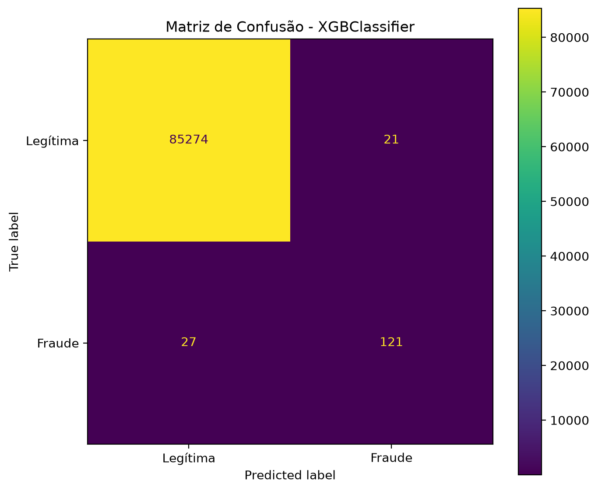
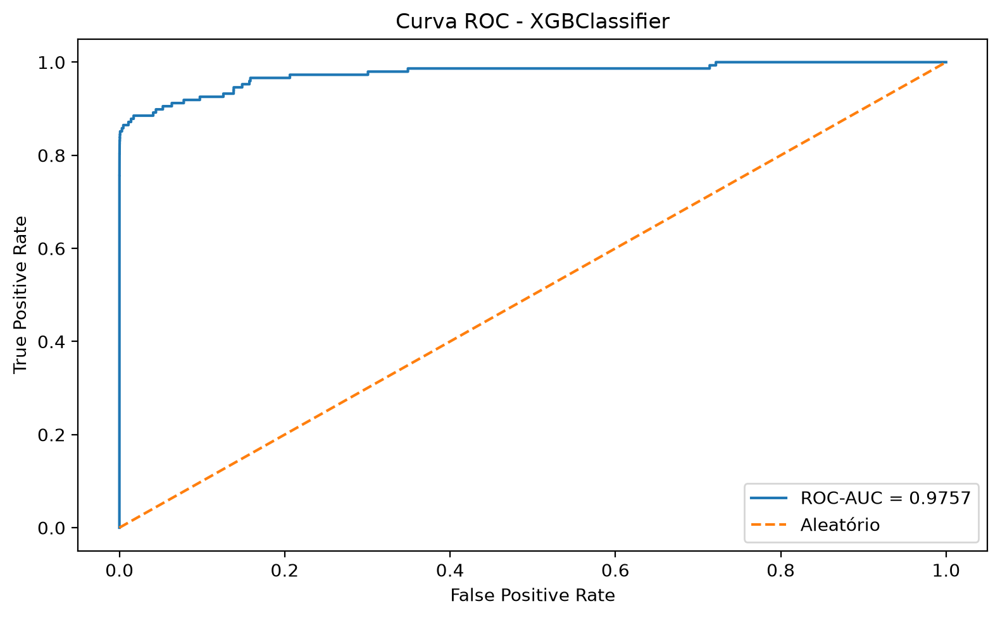
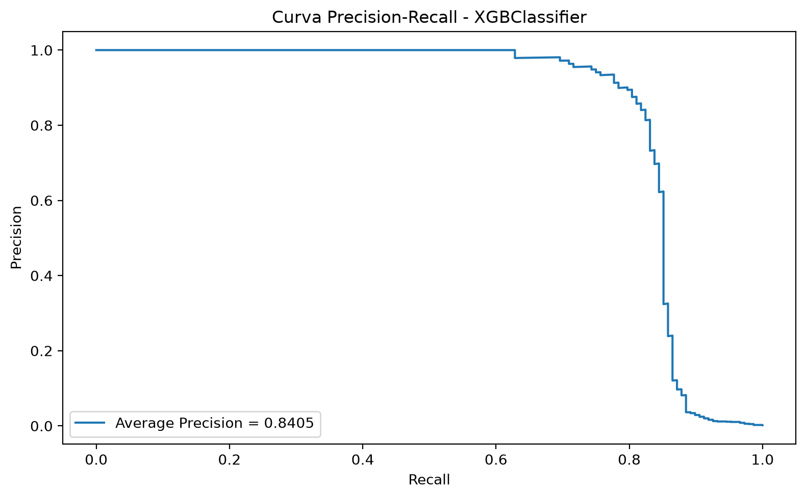
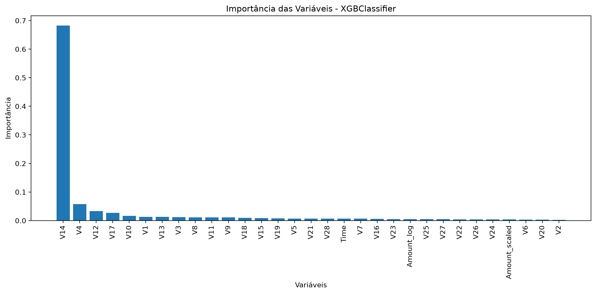
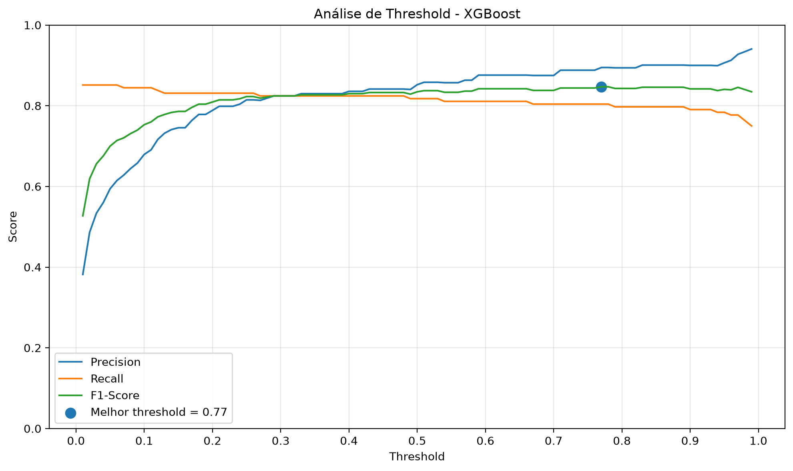

# 💳 Detecção de Fraudes em Cartões de Crédito com Machine Learning

> Projeto de Machine Learning aplicado à detecção de transações fraudulentas, com foco em **Python, análise de dados, tratamento de desbalanceamento, modelagem preditiva, avaliação de métricas e explicabilidade de modelos**.

[](https://www.python.org/)
[](https://pandas.pydata.org/)
[](https://scikit-learn.org/)
[](https://xgboost.readthedocs.io/)
[](https://shap.readthedocs.io/)
[](https://imbalanced-learn.org/)

---

## 🎯 Objetivo

Construir um pipeline de Machine Learning capaz de identificar **transações potencialmente fraudulentas** em um cenário altamente desbalanceado.

O projeto foi desenvolvido com uma preocupação central:

> **Em detecção de fraude, acertar as transações legítimas não é suficiente. É necessário identificar fraudes mantendo um nível aceitável de falsos positivos.**

Por isso, além da comparação entre modelos, o projeto analisa **Precision, Recall, F1-Score, ROC-AUC, Average Precision e diferentes thresholds de decisão**.

---

## 📊 Dataset

Foi utilizado o dataset público de transações de cartões de crédito disponibilizado pelo TensorFlow.

**Características:**

* **284.807 transações**
* **31 variáveis**
* **492 fraudes**
* Problema altamente desbalanceado
* Variável alvo: `Class`

  * `0` → transação legítima
  * `1` → fraude

As variáveis `V1` até `V28` representam componentes transformados por PCA. As variáveis `Time` e `Amount` também fazem parte do conjunto original.

O dataset bruto **não é versionado neste repositório**, sendo baixado automaticamente pelo pipeline quando necessário.

---

# 🏗️ Pipeline do projeto

```text
                 ┌─────────────────────┐
                 │      Dataset        │
                 │  Credit Card Fraud  │
                 └──────────┬──────────┘
                            │
                            ▼
                 ┌─────────────────────┐
                 │   Data Loading      │
                 │      Pandas         │
                 └──────────┬──────────┘
                            │
                            ▼
                 ┌─────────────────────┐
                 │  Preprocessing      │
                 │  log1p(Amount)      │
                 └──────────┬──────────┘
                            │
                            ▼
                 ┌─────────────────────┐
                 │ Train / Test Split  │
                 │     Stratified      │
                 └──────────┬──────────┘
                            │
                  ┌─────────┴─────────┐
                  │                   │
                  ▼                   ▼
          ┌──────────────┐    ┌──────────────┐
          │ StandardScaler│    │    SMOTE     │
          │  Train only   │    │  Train only  │
          └───────┬───────┘    └───────┬──────┘
                  │                    │
                  ▼                    ▼
          Logistic Regression    Random Forest
                                      │
                                      ▼
                                  XGBoost
                                      │
                                      ▼
                         ┌────────────────────────┐
                         │ Model Evaluation       │
                         │ Precision / Recall     │
                         │ F1 / ROC-AUC / AP      │
                         └────────────┬───────────┘
                                      │
                                      ▼
                         ┌────────────────────────┐
                         │ Threshold Optimization │
                         └────────────┬───────────┘
                                      │
                                      ▼
                              SHAP Explainability
```

---

# 🔬 Estratégia de tratamento dos dados

## Transformação de `Amount`

A variável `Amount` recebe uma transformação logarítmica:

```python
df["Amount_log"] = np.log1p(df["Amount"])
```

Essa transformação reduz o impacto de valores muito discrepantes e melhora a representação da variável para os modelos.

## Normalização

O `StandardScaler` é ajustado **somente sobre o conjunto de treinamento**:

```text
Treino → fit_transform()
Teste  → transform()
```

Essa estratégia evita **data leakage**, garantindo que informações estatísticas do conjunto de teste não sejam utilizadas durante o treinamento.

## Desbalanceamento

O dataset apresenta uma quantidade muito pequena de fraudes em comparação com transações legítimas.

Para os modelos de árvore, foi utilizado **SMOTE exclusivamente no conjunto de treinamento**.

```text
Treino original
      ↓
StandardScaler
      ↓
SMOTE
      ↓
Treino balanceado
```

O conjunto de teste permanece com sua distribuição original para representar melhor o cenário real de avaliação.

---

# 🤖 Modelos avaliados

Foram comparados três algoritmos:

### Logistic Regression

Utilizada como modelo de referência (*baseline*), com `class_weight="balanced"`.

### Random Forest

Modelo baseado em múltiplas árvores de decisão, treinado sobre o conjunto balanceado pelo SMOTE.

### XGBoost

Modelo baseado em Gradient Boosting e utilizado como principal candidato para o problema.

---

# 📈 Resultados

A avaliação foi realizada sobre um conjunto de teste contendo **85.443 transações**, preservando o desbalanceamento original.

| Modelo              |  Precision |     Recall |   F1-Score |    ROC-AUC | Average Precision |
| ------------------- | ---------: | ---------: | ---------: | ---------: | ----------------: |
| Logistic Regression |     0.0654 |     0.8784 |     0.1217 |     0.9676 |            0.7033 |
| Random Forest       |     0.6139 |     0.8378 |     0.7086 |     0.9790 |            0.7870 |
| **XGBoost**         | **0.8521** | **0.8176** | **0.8345** | **0.9757** |        **0.8405** |

### 🏆 Melhor modelo

O **XGBoost apresentou o melhor F1-Score entre os modelos avaliados**:

```text
F1-Score: 0.8345
Precision: 0.8521
Recall:    0.8176
ROC-AUC:   0.9757
```

Na avaliação padrão com threshold `0.50`:

```text
Verdadeiros Negativos: 85.274
Falsos Positivos:          21
Falsos Negativos:          27
Verdadeiros Positivos:    121
```

---

# 🎚️ Otimização do Threshold

Em problemas de fraude, o threshold padrão `0.50` nem sempre representa a melhor decisão de negócio.

Por isso, foi realizada uma análise de thresholds entre `0.01` e `0.99`.

O melhor resultado segundo o **F1-Score neste conjunto de teste** ocorreu em:

```text
Threshold: 0.77

Precision: 0.8947
Recall:    0.8041
F1-Score:  0.8470
```

Comparação:

| Configuração       |  Precision | Recall |         F1 |
| ------------------ | ---------: | -----: | ---------: |
| Threshold 0.50     |     0.8521 | 0.8176 |     0.8345 |
| **Threshold 0.77** | **0.8947** | 0.8041 | **0.8470** |

### Interpretação

Ao aumentar o threshold, o modelo se torna mais seletivo ao classificar uma transação como fraude.

Neste experimento, isso resultou em:

* aumento da Precision;
* pequena redução do Recall;
* aumento do F1-Score.

> **Importante:** o threshold `0.77` é uma decisão experimental baseada neste conjunto de teste. Em um ambiente de produção, o threshold deveria ser definido considerando custos reais de falsos positivos e falsos negativos, além de validação temporal e monitoramento do modelo.

---

# 🔎 Explainability com SHAP

Além de prever fraudes, o projeto busca responder:

> **Por que o modelo classificou determinada transação como potencialmente fraudulenta?**

Para isso foi utilizada a biblioteca **SHAP (SHapley Additive exPlanations)**.

O projeto gera uma explicação local para uma transação específica, permitindo analisar a contribuição das variáveis para a decisão do modelo.

### Exemplo gerado pelo projeto



---

# 📊 Visualizações

### Matriz de Confusão



### Curva ROC



### Precision-Recall



### Importância das Variáveis



### Análise de Threshold



---

# 🧠 Principais aprendizados técnicos

Este projeto foi desenvolvido para praticar conceitos relevantes para **Dados, Python e Machine Learning**, incluindo:

* análise de dados com Pandas;
* tratamento de dados desbalanceados;
* divisão estratificada de treino e teste;
* prevenção de data leakage;
* normalização de variáveis;
* transformação logarítmica;
* SMOTE;
* treinamento de modelos supervisionados;
* comparação de algoritmos;
* Precision, Recall e F1-Score;
* ROC-AUC;
* Average Precision;
* análise de matriz de confusão;
* otimização de threshold;
* interpretação de modelos;
* SHAP;
* persistência de modelos com Joblib;
* organização de projeto Python em módulos;
* geração automatizada de resultados.

---

# 🛠️ Tecnologias

| Tecnologia       | Utilização                      |
| ---------------- | ------------------------------- |
| Python           | Linguagem principal             |
| Pandas           | Manipulação e análise dos dados |
| NumPy            | Operações numéricas             |
| Scikit-learn     | Machine Learning e métricas     |
| XGBoost          | Modelo de Gradient Boosting     |
| Imbalanced-learn | SMOTE                           |
| SHAP             | Explainability                  |
| Matplotlib       | Visualização                    |
| Joblib           | Persistência dos modelos        |
| Git / GitHub     | Versionamento                   |

---

# 📁 Estrutura do projeto

```text
deteccao-fraudes-cartao/
│
├── data/
│   ├── raw/
│   └── processed/
│
├── docs/
│   ├── imagens/
│   └── apresentacao/
│
├── models/
│
├── notebooks/
│
├── results/
│   ├── XGBClassifier_confusion_matrix.png
│   ├── XGBClassifier_precision_recall.png
│   ├── XGBClassifier_roc.png
│   ├── feature_importance.png
│   ├── metricas.csv
│   ├── shap_local.png
│   ├── threshold_analysis.csv
│   └── threshold_analysis.png
│
├── src/
│   ├── config.py
│   ├── data_loader.py
│   ├── evaluate.py
│   ├── explainability.py
│   ├── main.py
│   ├── preprocessing.py
│   ├── threshold_analysis.py
│   └── train.py
│
├── .gitignore
├── README.md
└── requirements.txt
```

---

# ▶️ Como executar

## 1. Clonar o repositório

```bash
git clone https://github.com/eltonjsilva05-spec/deteccao-fraudes-cartao.git

cd deteccao-fraudes-cartao
```

## 2. Criar ambiente virtual

### Windows

```bash
python -m venv .venv
```

Ativar:

```bash
source .venv/Scripts/activate
```

ou, no PowerShell:

```powershell
.venv\Scripts\Activate.ps1
```

## 3. Instalar dependências

```bash
pip install -r requirements.txt
```

## 4. Executar o pipeline

```bash
python src/main.py
```

Caso o dataset ainda não esteja presente em `data/raw/`, o projeto realiza o download automaticamente.

Os resultados serão gerados em:

```text
results/
```

---

# 📌 Próximas evoluções

Algumas possibilidades para evolução do projeto:

* validação temporal (*time-based validation*);
* engenharia de features;
* calibração das probabilidades;
* otimização de hiperparâmetros;
* comparação com modelos adicionais;
* análise de custo de falsos positivos e falsos negativos;
* pipeline de inferência para novas transações;
* API para disponibilização do modelo;
* monitoramento de *data drift* e *model drift*;
* containerização com Docker;
* integração com pipeline de dados.

---

# 👨‍💻 Sobre o projeto

Este projeto faz parte do meu portfólio de transição e desenvolvimento profissional na área de **Dados e Tecnologia**, com foco em Python, SQL, Machine Learning e Engenharia de Dados.

Meu objetivo é desenvolver soluções que transformem dados em **informação útil para tomada de decisão e resolução de problemas reais de negócio**.

---

## 👤 Autor

**Elton Jhon Silva**

**Data & Python | SQL | ETL/ELT | Machine Learning | Power BI**

🔗 LinkedIn: [linkedin.com/in/eltonjsilva](https://www.linkedin.com/in/eltonjsilva)

🔗 GitHub: [github.com/eltonjsilva05-spec](https://github.com/eltonjsilva05-spec)

---

⭐ Se este projeto foi útil ou interessante, considere deixar uma estrela no repositório.
